# Githubハンズオン

## 何がいるねん
  - Githubアカウント[ココ]()から作ってください
  - Gitクライアントソフト(今回はSource Tree インストール方法は[こっち](../install-sourcetree.md)やで)
  <!-- github for windows 使いにくいねん -->
  - 根気

## リポジトリ作ってみよか
Git等ではファイルを置いておくフォルダをリポジトリと呼びます。
まずはGithub上にリポジトリをつくってみましょう。
[このページ](https://github.com/EnyaKitakagaya)に行ってください。

緑のボタンがあるとおもいます。押しちゃってください。

[ 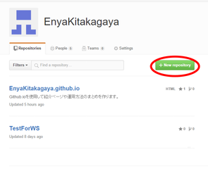 ](imgs/origin/img1.png)

すると下の図のような画面に移ります。
なんか色々入力しろと言われますので、入力してください。

[ 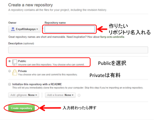 ](imgs/origin/img2.png)

| 記入箇所 | 説明 |
| -----|-----|
| Repository name | 作りたいリポジトリの名前を入れてください ｜
| Public or Private | Public:無料,private:有料 |
| Initialize this... | チェック入れておくとREADMEファイル作ってくれます |

入力できたら、緑色のボタンを押してください。

緑色ボタンを押すとこんな感じのページに移動するとおもいます。

[ 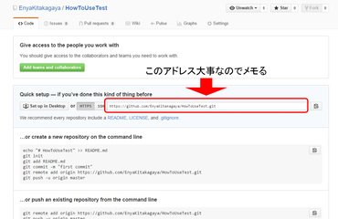 ](imgs/origin/img3.png)

これでリポジトリを作ることができました！

**赤線で囲った部分のURLをこの後使うのでメモしといてください。**

## クローンするで

Git等のバージョン管理システムでは、サーバー上のリポジトリをリモートリポジトリ、
自分のPCにあるリポジトリをローカルリポジトリと呼びます。
リモートリポジトリにあるデータをローカル丸っとコピーしてくることを **クローン**と呼びます。

それではPCにさっき作ったリポジトリをクローンしてみましょう。
SourceTreeを起動してください。

[ 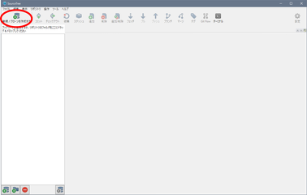 ](imgs/origin/img4.png)

赤で丸を付けた「新規/クローンを作成する」と書かれたボタンを押してください。
そうするとこんな画面に切換わります。

[ 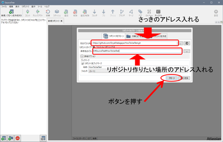 ](imgs/origin/img5.png)

  | 記入箇所 | 記入内容 |
  | - | ------- |
  | 元パス/URL | さっきメモったURLを記入. |
  | 保存先のパス | ローカルリポジトリを作りたい場所を記入、右の'...'ボタンを押すとフォルダを選択できます。 |　　　　　

入力したら「クローン」ボタンを押してください。
クローンに成功するとこんな感じの画面になります。

[ 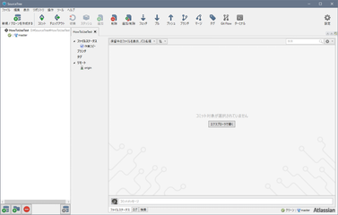 ](imgs/origin/img6.png)

-------
 ## コミット&プッシュしてみよか

保存先に指定したフォルダはこんな感じになっています。

[ 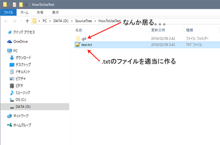 ](imgs/origin/img7.png)

なんか「.git」とかいう名前の変なフォルダが居ると思います。
適当なテキストファイルをいれてください。

そしたら**コミット**します。
**コミット**とは、現在のファイルの中身の記録を残すことです。
SourceTreeの画面に行ってみましょう。
「コミット」と書かれたボタンを押してください。

[ 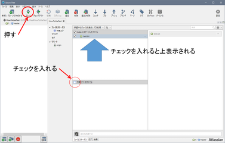 ](imgs/origin/img8.png)

SourceTreeの画面にさっき作ったファイルがいてますね。
ファイルのチェックボックスにチェックを入れると上のほうに表示されます。

今回はコミットするのと同時にリモートリポジトリつまりGithubのサーバーにアップロードします。
この操作を「**プッシュ**」と呼びます。

[ 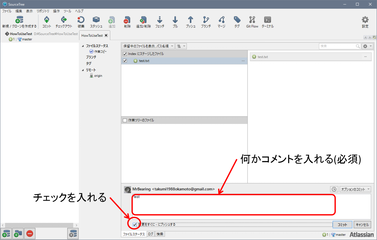 ](imgs/origin/img9.png)

コミットメッセージを記入して、「変更をすぐにプッシュ」するの四角にチェックを入れて**右下**の「コミット」ボタンを押してください。

こんな画面に移るので、赤丸の部分にチェックを入れて、「OK」ボタンを押してください。

[ 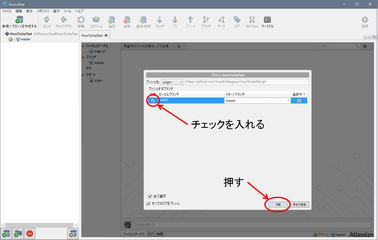 ](imgs/origin/img10.png)

-------

## Github上で更新してみるで
Githubでリポジトリを見てみましょう。
Githubにファイルがアップロードされてますね。
ほいだら、リンクになってるのでクリックしてみましょう。

[ 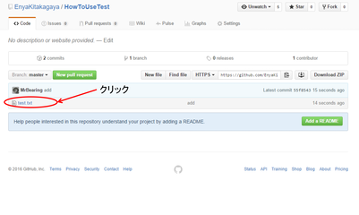 ](imgs/origin/img12.png)

クリックするとこんな画面になって、さっきフォルダに放り込んだファイルの中身が表示されてます。
右肩のあたりにあるペンみたいなボタンを押してください。

[ 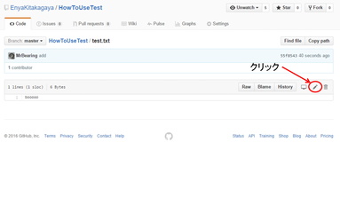 ](imgs/origin/img13.png)

編集ができるようになるので、何か適当に追加で書き足して、
下のほうにスクロールしてください。

[ 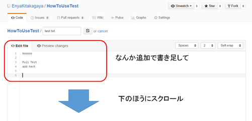 ](imgs/origin/img14.png)

下のほうにこんな感じのスペースがあります。
コミットメッセージを記入して、「Commit changes」って書かれたボタン押してください。

[ 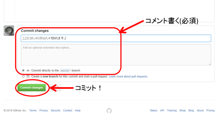 ](imgs/origin/img15.png)

## pullするで

SourceTreeに戻って、「プル」って書かれたボタンを押してください。
そうすると下の画像みたいな画面になると思います。
「OK」ボタンを押しちゃってください。

[ 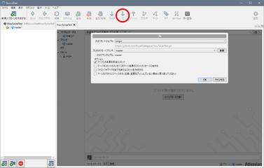 ](imgs/origin/img16.png)

待機画面が表示されて、元の画面が表示されます。

[ 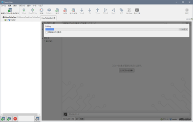 ](imgs/origin/img17.png)

[ 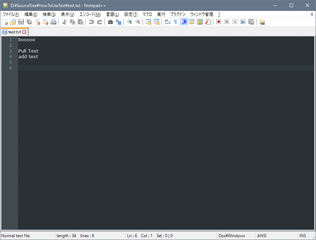 ](imgs/origin/img19.png)

## おさらい
### 覚えなアカン言葉
  - リポジトリ
  - クローン リポジトリを自分のPCに丸っとコピーしてくること
  - プル 誰かが更新したりしてできた差分をリポジトリから持ってくること
  - コミット 自分のPCで変更した記録をつけること
  - プッシュ 自分のところの変更をリモートリポジトリにアップロードすること

## ほかにも色々
複数人で編集すると、衝突が起こったときどうするとか色々ありますが、今回はここまで
