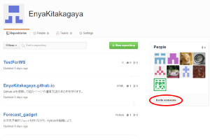
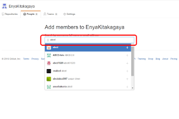
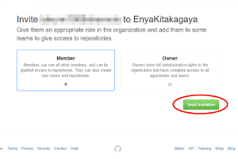
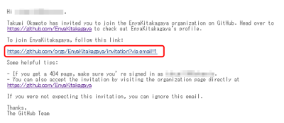

#GitHubのチームにユーザーを招待する方法

GitHubのえんやのチームに誰かを招待する方法が結構わかりにくいので、やり方をまとめました。

##必要なもの
- 招待する相手のGithubアカウント
- えんやチームに所属しているGithubアカウント

##やり方
まず[このページ](https://github.com/EnyaKitakagaya)に行きます。

 ** invite ** と書かれたボタンを押してください。

招待する人のユーザー名を入力してください

オーナーかメンバーのどちらで招待をするかを聞かれますので選択して、
[Send inviteation]のボタンを押してください。

|  |  |
| ------ | ------ |
| Owner | そのチームに対してのすべての権限を持つ人、リポジトリ消したりできちゃいます。|
| Memmber | リポジトリを作ったり、閲覧・コミットが可能な人 |

そうすると、招待する相手にこんな感じのメールが届きます

2つ目のリンクをクリックしてもらってください。

こんな画面に遷移するので、緑色のボタンを押してもらってください。

これで招待ができました。

(誤字脱字の指摘・コメント等ありましたら連絡ください。直接編集してくださってもOKです。)
